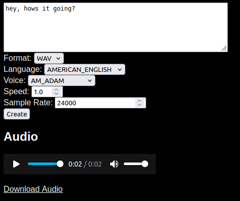

# Kokoro Slim

Other Kokoro repositories are like soiled napkins. Here is a clean wrapper for Kokoro.

## Set Up

This script assumes you have python3.12 installed.

```python
python -m venv venv
source venv/bin/activate
python -m pip install -r requirements.txt
```

If you are wanting to generate mp3's, `sudo apt install ffmpeg`.

## Running

`tts.py` contains a python API.

```python
python tts.py
```

`web.py` contains a web page.

```python
python web.py
```

